# Sesion 1 - Guías de estilo y personalizaciones avanzadas

## Guías de estilo y personalizaciones avanzadas

En esta sesión hablaremos de los patrones de diseño que Apple nos recomienda seguir para nuestras aplicaciones. En algunos casos es obligatorio cumplir estos patrones a la hora de diseñar nuestras aplicaciones y el hecho de no hacerlo puede ser motivo de rechazo para publicar en el _App Store_. Comentaremos las distintas características de cada dispositivo iOS. Por último detallaremos distintas técnicas que existen para personalizar los controladores y vistas más usadas y, de esta forma, conseguir un aspecto más atractivo para el usuario final.

### Guías de estilo en iOS

Tanto el iPhone como el iPad supusieron un revolucionario giro en cuanto a diseño de interfaz se refiere. Para evitar el caos a la hora de diseñar cualquier tipo de aplicación, tras cada actualización de iOS _Apple_ plantea una serie de guías de estilo que todo desarrollador debe seguir en la medida de lo posible para diseñar una aplicación. Estas guias de estilo no son válidas, como es lógico, a la hora de diseñar la interfaz de un juego, sólo son útiles en aplicaciones.

En esta sesión vamos a aprender a diseñar aplicaciones de iPhone / iPad que sean usables, accesibles y en las que el usuario perciba una grata experiencia al hacer uso de ellas. Hay que tener en cuenta que un usuario de iPhone está habituado a una serie de elementos y situaciones básicas como la navegación dentro de vistas mediante _Navigation Controllers_, navegación por las opciones fundamentales mediante los _Tab Bar Controllers_, uso de botones claros, etc. Aquí haremos un resumen de todo lo que Apple propone en sus [guias de estilo](https://developer.apple.com/ios/human-interface-guidelines/). A pesar de que nos centraremos en los aspectos principales de la guía, es recomendable leer por completo las guías de estilo tras cada actualización de iOS.

Además de la guía de estilo oficial, conviene consultar detalladamente estos dos enlaces:

[iOS Design do's and don'ts](https://developer.apple.com/design/tips/)

[Designing for iOS](http://v1.designcode.io/iosdesign-guidelines) \(este enlace no es de Apple\).

Veremos 3 puntos principales:

* Principios de diseño
* Características de la plataforma iOS
* Guías de uso de las principales tecnologías disponibles en iOS

#### Principios de diseño

_Apple_ recomienda diseñar apps siguiendo estos tres principios:

* **Claridad**. En nuestras apps el texto debe poder ser legible a cualquier tamaño, los iconos deben ser precisos y claros, los adornos poco recargados y apropiados, y debemos centrarnos principalmente en la funcionalidad. Los espacios negativos, colores, fuentes, gráficos y elementos del interfaz deben resaltar el contenido importante y facilitar la interactividad.
* **Amigabilidad**. Un interfaz fluido, claro y visualmente atractivo ayuda a los usuarios a entender e interactuar con el contenido, que normalmente ocupa la pantalla completa. Las transparencias y los elementos difuminados ofrecen al usuario guías sobre en qué puntos interactuar. Es recomendable no usar gradientes, brillos o sombras, ya que esto ayuda a mantener el interfaz ligero y claro mientras que el contenido destacará mejor.
* **Profundidad**. Las distintas capas visuales y el movimiento realista deben facilitar la comprensión de la jerarquía del interfaz e imprimir dinamismo. Tocar y descubrir mejora la sensación de interacción y permite el acceso a funcionalidades y contenidos adicionales sin perder el contexto. Las transiciones proporcionan una sensación de profundidad mientras se navega por el contenido.

En general, lo principal que deben tener las aplicaciones es:

* Integridad estética: debemos integrar adecuadamente el aspecto visual con su funcionalidad.
* Consistencia: deben usarse elementos estándar a los que ya están habituados los usuarios de iOS y un diseño uniforme.
* Manipulación directa: es recomendable que cuando se rota el dispositivo o se usan gestos el contenido de la pantalla cambie.
* _Feedback_: se deben confirmar las acciones y mostrar resultados para informar al usuario de que ha interactuado con nuestra app.

Antes de comenzar a diseñar una aplicación también es muy importante conocer quiénes son los usuarios a los que nos dirigimos, es decir, el público objetivo, y en función de esto definir la interfaz gráfica, los controles, terminología, etc. No es lo mismo diseñar una app para niños que una de contabilidad, o una app para empresas.

Se recomienda hacer todo el diseño previo usando Mockups, o bien hacerlo en el storyboard antes de que la aplicación sea funcional. Existen varias herramientas de Mockups, tales como [mockup.io](https://mockup.io/) o [Balsamiq](https://balsamiq.com).

**Diseño según el dispositivo**

La aplicación que diseñes debe estar totalmente adaptada a un dispositivo iOS, no a otro tipo ni a web. El usuario lo agradecerá \(y Apple también\). La inmensa mayoria de usuarios de iOS están acostumbrados al uso de botones, barras de navegación, _Tab Bars_, etc. Debemos, en la medida de lo posible, hacer uso de toda esta serie de componentes que son diseñados de forma específica para dispositivos iOS y con los que los usuarios están muy familiarizados.

Se recomienda usar los componentes estándar de Apple, cuya referencia se puede encontrar en el [Catálogo de UIKit](https://developer.apple.com/library/ios/documentation/UserExperience/Conceptual/UIKitUICatalog/index.html).

Otro tema importante es que si la aplicación es universal, esta debe de funcionar correctamente tanto en iPhone como en iPad. Hay que asegurarse antes de publicarla en _App Store_ de que no hay bugs ya que si estos existen Apple puede rechazar la aplicación, o también puede ocurrir que el usuario la puntúe mal o deje de usarla. Existen una serie de puntos a tener en cuenta en este caso:

* Hay que modelar cada aplicación según el dispositivo en el que se use teniendo en cuenta especialmente las capas de vistas, ya que estas cambian bastante.
* Se debe de adaptar todo el arte \(imágenes, videos, etc.\) al dispositivo adecuado. El iPad y el iPhone 6 tendrán un arte con mayor resolución que un iPhone 4, por ejemplo. Los _Assets_ sirven para esto.
* Las características de la aplicación deben conservarse a pesar del tipo de dispositivo que se use.
* Evidentemente, se debe intentar diseñar la aplicación universal y no únicamente para iPhone o iPad.

#### Características principales de la plataforma iOS

**La pantalla**

Todo usuario que usa una aplicación interactúa mediante la pantalla. Es por ello que este es el componente más importante que podemos encontrar en cualquier dispositivo iOS. Existen distintas resoluciones de pantalla \(a nivel de desarrollo de código y a nivel físico\) según cada dispositivo. Un ejemplo de la resolución en puntos de cada dispositivo que debe tener en cuenta el desarrollador:

* _iPhone 4S_ y modelos anteriores: 320 x 480 puntos
* _iPhone 5/5S_: 320 x 568 puntos
* _iPad_: 768 x 1024 puntos
* _iPhone 6/6S_ : 375 x 667 puntos
* _iPhone 6/6S plus_ : 414 x 736 puntos

Se puede consultar la resolución de todos los modelos de Apple en [http://iores.com](http://iosres.com).

El tamaño en puntos no es el mismo que el tamaño en píxeles, que normalmente es un múltiplo \(2x, 3x\) de los puntos, como puede verse en el siguiente ejemplo:

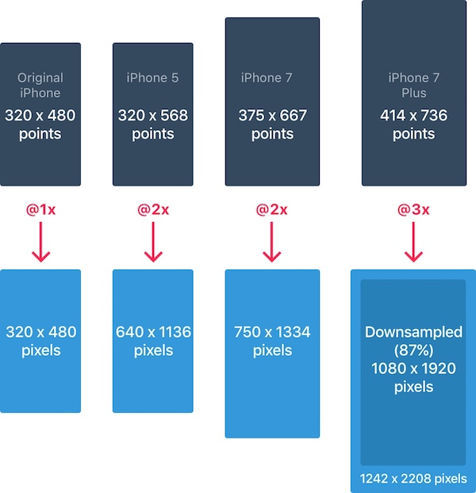

> Detección de contacto \(touch events\). El tamaño de la zona mínima para que el evento de contacto funcione correctamente debe de ser de al menos 44 x 44 puntos.

**Orientación del dispositivo**

Uno de los requisitos a la hora de publicar una aplicación de iPhone/iPad en el _App Store_ es la compatibilidad con las distintas posiciones que puede adoptar el dispositivo iOS, tanto vertical \(_portrait_\) como horizontal \(_landscape_\). Cualquier aplicación debe de estar adaptada a ambas posiciones para mejorar la usabilidad y la comodidad a la hora de utilizar la aplicación. La programación de la orientación en una aplicación iOS es relativamente sencilla, excepto casos puntuales y no implementarla puede suponer, como hemos comentado, el rechazo de su publicación en el _App Store_.

A continuación puedes ver las orientaciones de un iPhone y su layout:

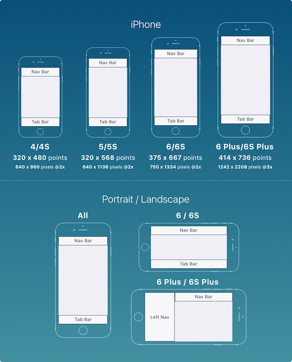

Y para el iPad:

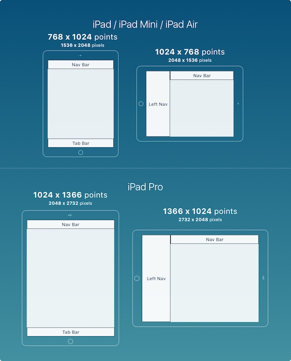

**Diferentes storyboards**

Tenemos que diseñar un [LaunchScreen.storyboard](https://developer.apple.com/ios/human-interface-guidelines/graphics/launch-screen/) para la pantalla de inicio \(que se muestra brevemente al arrancar la aplicación\), y otro para nuestra app \(Main.storyboard\).

**Los multigestos**

Un punto que hay que tener muy presente a la hora de diseñar y programar una aplicación en cualquier dispositivo iOS es el uso de los gestos. Llamamos gestos a los distintos movimientos que hace el usuario sobre la pantalla para realizar distintas acciones. Cuantos más gestos se implementen en una aplicación, más agradable e intutiva será de usar para el usuario final. En la sesión de _multitouch_ veremos en detalle cómo gestionar los gestos.

**La multitarea**

Mediante la multitarea nuestro dispositivo puede ejecutar más de dos aplicaciones al mismo tiempo. Otras tareas que no estén mostrándose en pantalla pueden estar almacenadas en memoria, es decir, en _background_, o también mostrándose simultáneamente en la pantalla. Apple recomienda que nuestra aplicación tenga en cuenta dicha característica ya que de esta forma el usuario puede estar realizando otras tareas al mismo tiempo sin necesidad de cerrarla.

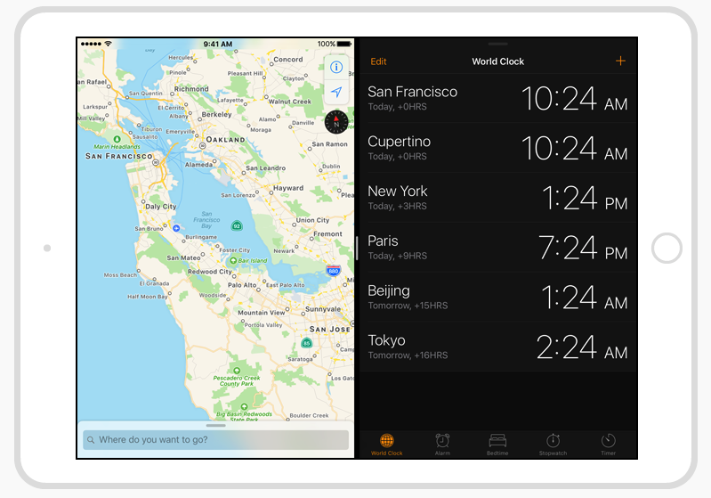

La aplicación debe estar preparada para gestionar interrupciones de audio en cualquier momento, pararse y reiniciarse sin ninguna complicación ni lag y de forma "suave", y debe comportarse de forma adecuada cuando se encuentra en _background_. La multitarea es una tecnología que se utiliza muy a menudo en iOS y es por ello que debemos tenerla muy presente a la hora de programar nuestras aplicaciones. La gestión del paso de un estado _activo_ a _inactivo_ debe programarse cuando sea necesario. Por ejemplo, hay que tener en cuenta que nuestro juego puede interrumpirse por una llamada a mitad del lanzamiento de un pájaro.

Para determinar el comportamiento de nuestra aplicación cuando entra en _background_ podemos cambiar los métodos `applicationDidEnterBackground` y `applicationWillEnterForeground`. Esta parte se explicará en otras asignaturas del máster.

**Preferencias**

Si la aplicación utiliza preferencias propias, podemos hacer una vista para ellas dentro de nuestra aplicación en el caso de que el usuario necesite cambiarlas con frecuencia, o bien añadir un _settings bundle_ si esto no es tan frecuente. Un _settings bundle_ contiene ficheros \(principalmente _.plist_\) que describen la estructura y estilo de presentación de las preferencias, y es muy sencillo de implementar. La app _Settings_ usa esta información para crear una entrada para nuestra aplicación y mostrar las preferencias.

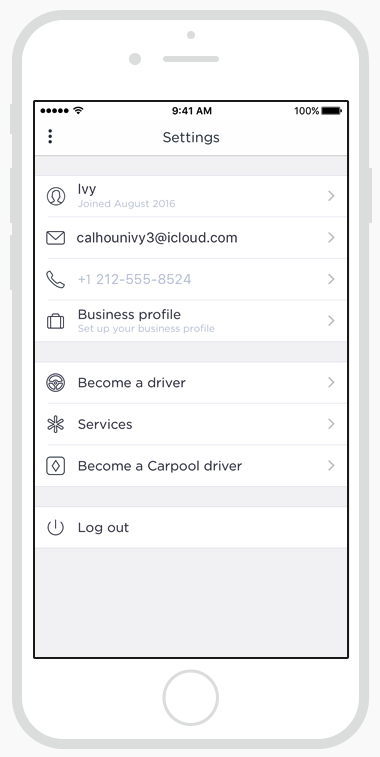

**Ayuda**

La aplicación debe ser lo suficientemente intuitiva para que el usuario sepa usarla. **Lo ideal es que no sea necesario ningún texto de ayuda**, pero si existe debe ser lo más claro y compacto posible, y si se pueden utilizar imágenes o videos, mejor.

Hay que tener en cuenta que el usuario no tendrá tiempo ni ganas de estar leyendo la ayuda antes de utilizar la aplicación, además de que el espacio que ocupa se puede emplear para otros contenidos que sean de mayor importancia. La ayuda no debería ser necesaria si se utilizan las guias de estilo establecidas por Apple y que tienen por finalidad, como hemos comentado anteriormente, establecer una interfaz simple e intuitiva de usar.

#### Guías de uso de las principales tecnologías disponibles en iOS

La API de iOS nos da acceso a múltiples tecnologías nativas que nos permiten realizar distintas tareas que posiblemente sean de utilidad a la hora de usar la aplicación que desarrollemos. A continuación se comentan las principales:

**App extensions \(extensiones\)**

Con las extensiones \(añadidas en iOS8\), los usuarios pueden usar un componente desarrollado por nosotros desde una app externa. Por ejemplo, mientras un usuario ve una web con Safari, podría usar nuestras extensiones para enviar una imagen o un artículo a nuestra red social. O podría también usar desde la aplicación de fotos de Apple una extensión nuestra para editar la imagen.

Las extensiones pueden ser de tipo _widget_, para realizar acciones desde el notification center, _share_ para compartir contenido con terceros, _action_ para ver contenido desde otra aplicación, _photo editing_ para editar imágenes, o _custom keyboard_ para reemplazar el teclado de iOS por uno personalizado, entre otras posibilidades.

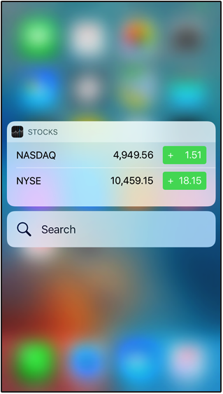 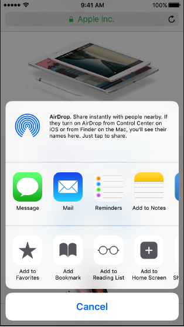

**Notificaciones**

Las notificaciones push permiten a los usuarios estar avisados en cualquier momento, independientemente de si la aplicación está funcionando en ese mismo instante. Esto es muy útil en aplicaciones que hagan uso de un calendario, para avisar de eventos futuros, o aplicaciones con algún tipo de recordatorio. También se utiliza muy a menudo en juegos, sobre todo en juegos sociales.

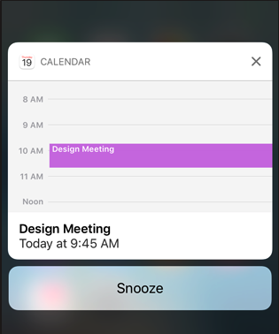 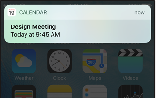

La implementación de este servicio por parte del desarrollador es algo compleja y requiere de un servidor propio, aunque se pueden contratar servicios externos que realicen esa tarea de forma bastante económica. Al mismo tiempo que se activa la notificación _push_ se muestra un número en la esquina superior derecha del icono de la aplicación. A esto se le llama _badge_ y es muy sencillo de implementar en nuestras aplicaciones.


**Social media \(redes sociales\)**

Podemos querer que nuestros usuarios accedan a redes sociales desde nuestra aplicación. Para ello, Apple tiene una serie de clases que facilitan el acceso a las mismas mediante una extensión como se ha visto anteriormente, que podemos configurar para esta tarea.

**iCloud**

Con iCloud disponemos de un espacio de almacenamiento en la nube accesible por nuestros usuarios independientemente del dispositivo en el que estén trabajando. Cuando integramos iCloud en nuestra aplicación, los usuarios pueden usar distintas instancias de las misma en distintos dispositivos para ver y editar contenidos sin tener que hacer una sincronización explícita.

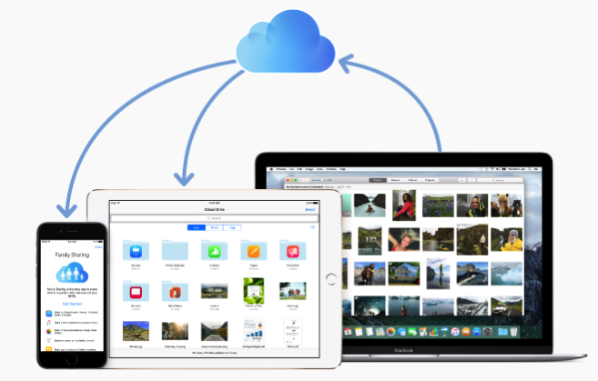

**In-App purchase**

Podemos hacer que los usuarios realicen compras desde nuestra aplicación. Esto es muy común en juegos, por ejemplo, donde se pueden comprar objetos con dinero real. También podemos usarlo para actualizar de una versión gratuita \(básica\) a una versión de pago \(premium\) o para renovar una subscripción, por ejemplo.

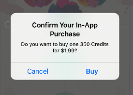

**Passbook \(Wallet\)**

Con Wallet podemos gestionar _passes_, que son representaciones de objetos físicos como tarjetas de embarque, cupones, o tickets. Podemos crear un _pass_, distribuirlo a los usuarios, y actualizarlo cuando creamos oportuno.

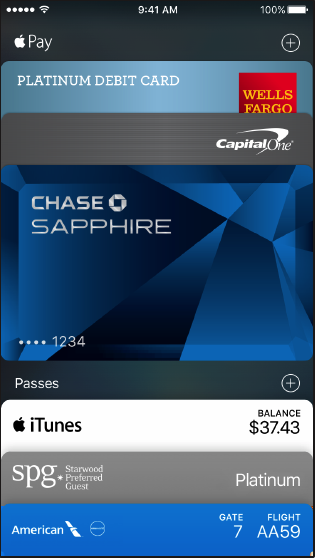

**Game center**

Game Center permite a los usuarios participar en distintos juegos y organizar partidas multijugador online, por ejemplo. Los jugadores pueden usar la app _Game Center_ para entrar en su cuenta, descubrir nuevos juegos, añadir amigos, y ver los resultados conseguidos.

**AirPrint \(imprimir\)**

Mediante _Airprint_ se puede enviar a imprimir cualquier documento que deseemos desde nuestras aplicaciones. La API de iOS se encarga de gestionar la localización de impresoras y la ejecución de tareas de impresión, mientras que el desarrollador se encarga de especificar qué elemento/s desea imprimir \(normalmente PDF o imágenes\).

**Servicios de localización**

Los servicios de localización permiten a los usuarios acceder a una situación geográfica en cualquier momento y lugar. Si nuestra aplicación hace uso de los mapas, por ejemplo, estos intentarán a su vez hacer uso de los servicios de localización del dispositivo para poder situar de una forma bastante certera la posición actual del usuario en el mapa.

Al intentar hacer uso de estos servicios, la aplicación lanzará una ventana emergente preguntando por los permisos de acceso. Los sistemas de localización se basan principalmente en la brújula, GPS y Wifi.

**QuickLook \(Vista rápida de documentos\)**

Mediante esta opción los usuarios pueden acceder a una vista previa de documentos descargados desde las aplicaciones. Dependiendo del dispositivo a utilizar, los documentos se presentarán dentro de una ventana modal, si trabajamos en un iPad, o dentro de una vista completa si es un iPhone.

**Siri**

Desde _iOS 10_, podemos desarrollar apps integradas con Siri para realizar ciertas tareas en respuesta a comandos hablados y a preguntas de los usuarios.

Por ejemplo, podemos iniciar llamadas o buscar en el histórico de llamadas, enviar mensajes o leer mensajes recibidos, aceptar pagos, buscar o mostrar fotos, reservar viajes o proporcionar información sobre los mismos, e incluso con _CarPlay_ podemos cambiar la fuente de audio en el coche, la temperatura del asiento o la emisora de radio.

**Sonidos**

Puede que como desarrollador estés interesado en reproducir sonidos dentro de tu aplicación, bien porque sea necesario o por producir un efecto agradable en el usuario. Para evitar justamente lo contrario, hay que tener en cuenta que:

* Si el usuario activa el modo _silencio_ en el dispositivo, este no debe de emitir ningún tipo de sonido. Hay apps que se saltan esto, y suele ser algo bastante molesto. Además, si nuestra app se basa completamente en el sonido \(por ejemplo, un reproductor musical\) puede que tengamos que hacer alguna acción \(por ejemplo pausar la música\) cuando se silencie el móvil.
* En la medida de lo posible, se debe dejar al usuario la opción de ajustar el volumen de sonido como desee.
* El tipo de sonido escogido para las distintas características de la aplicación es muy importante. Estos sonidos deben ser adecuados y se deben ajustar al tipo de acción que se esté ejecutando.
* Hay que tener también en cuenta la gestión de las interrupciones de audio. Por ejemplo, puede producirse una llamada entrante, la aplicación pasar a estado inactivo \(_background_\), etc.
* Si estamos desarrollando una aplicación musical, para mejorar la experiencia de usuario también podemos usar el control remoto de Apple o el sistema _AirPlay_.

**VoiceOver \(Accesibilidad\)**

El sistema de control por voz _VoiceOver_ está diseñado para mejorar la accesibilidad para personas con discapacidades visuales o también para usuarios con interés en el aprendizaje de una lengua extranjera.

**Menú de edición**

Existe un [menú contextual de edición](https://developer.apple.com/ios/human-interface-guidelines/ui-controls/edit-menus/) básico que incorpora iOS por defecto. Este contiene las opciones de copiar, cortar y seleccionar. Los desarrolladores podemos modificar este menú si queremos, eliminando o incluyendo nuevas opciones que se ajusten más a nuestra aplicación.

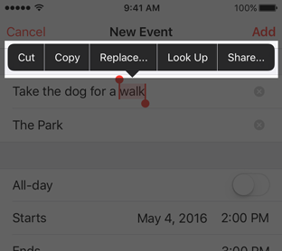

**Teclado**

El teclado virtual es totalmente modificable según nuestros requerimientos. Por ejemplo, si queremos utilizar un teclado numérico sólo deberemos indicarlo al cargar el teclado dentro del método adecuado. Desde iOS8, se permite añadir teclados personalizados además de los que vienen con el sistema.

## Ejercicios

Básicamente estos son los conceptos principales de la guía de estilo de Apple, aunque hay más tecnologías que pueden verse en su [guía de estilo](https://developer.apple.com/ios/human-interface-guidelines/).

A continuación vamos a empezar programando ejemplos de personalización de controladores. Llamaremos personalizaciones a las modificaciones sobre el aspecto visual de los componentes estándar de Apple. Normalmente las personalizaciones no son recomendables para no confundir al usuario, pero a veces son necesarias para juegos o aplicaciones que requieran un aspecto diferente, como puede verse en el siguiente ejemplo:

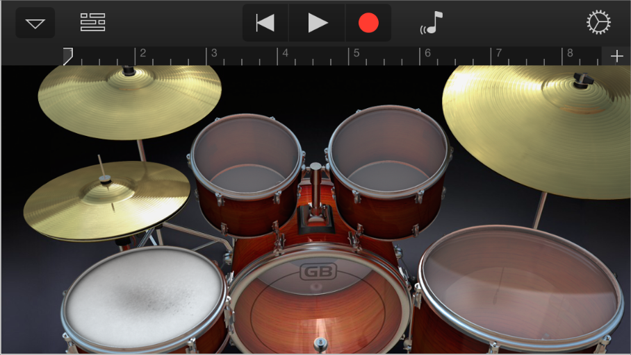

### Ejercicio 1- Personalización de celdas

La captura siguiente muestra la pantalla principal del cliente de Twitter para iPhone _Twinkle_ \(en iOS6\) y, aunque no lo parezca, es simplemente una tabla con las celdas totalmente personalizadas.

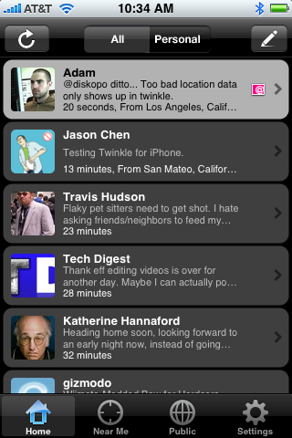

A diferencia de la personalización de otros componentes, la personalización de celdas de una tabla es algo muy habitual \(y a veces necesaria\) en iOS. Con esto podremos hacer que nuestras tablas se distingan del resto, mostrar datos de forma más adecuada, y ofrecer un "toque" característico y concordante con nuestras aplicaciones.

¿Cómo podemos hacer este tipo de celdas en nuestra aplicación iOS? Es muy sencillo, a continuación veremos mediante un ejemplo paso a paso el diseño y programación de celdas personalizadas con el _Interface Builder_ de XCode.

#### Creando el proyecto y las clases básicas

Al terminar este ejemplo tendremos una aplicación formada únicamente una vista de tabla `UITableView` con celdas personalizadas. Estas celdas tendrán una imagen en el lado izquierdo, un texto en negrita en la parte superior y otro texto pequeño en la parte inferior. Las celdas tendrán un tamaño algo mayor al que viene por defecto y, para finalizar, la tabla tendrá estilo _zebra_, es decir, el fondo de las celdas tendrá colores intercalados para cada fila.

Comenzaremos creando el proyecto. Para ello, abrimos XCode y creamos un nuevo proyecto de tipo _Single View Application_ en Swift. Lo guardaremos con el nombre `ejercicio_celdas`. Vamos a arrastrar al storyboard un nuevo controlador de tipo _Table View Controller_.

Ahora haremos que nuestra tabla sea lo primero que aparezca en el storyboard. Esto se puede hacer, por ejemplo, arrastrando la flecha horizontal que apunta al primer controlador \(la vista vacía\) hacia nuestro nuevo _Table View Controller_. Ya podemos borrar la vista vacía del storyboard, que ahora comenzará con nuestra tabla. Podemos también borrar el fichero `ViewController.swift`, ya que estaba asociado a la vista que hemos borrado.

Ya tenemos la vista de la tabla, pero vamos a crear también un fichero de código como controlador, para poder programar los elementos de la celda. Seleccionamos _File &gt; New &gt; File &gt; Cocoa Touch Class_, y le damos el nombre `TableViewController`, subclase de `UITableViewController`, dejando sin marcar "_Also create XIB file_". Ahora tenemos que asignar la vista al controlador. Para ello, seleccionamos el controlador en el storyboard, y desde el _Attribute Inspector_ le asignamos la clase que hemos creado `TableViewController`, como se muestra en la imagen:

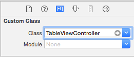

Por último, para nuestra vista personalizada vamos a crear un nuevo fichero subclase de `UITableViewCell`. Hacemos click en _File &gt; New &gt; File &gt; Cocoa Touch Class_, y seleccionamos Subclass of `UITableViewCell`, dejando sin marcar "_Also create XIB file_". Lo guardamos con el nombre `TableViewCell`.

#### Diseñando la celda desde Interface Builder

Una vez hemos creado el proyecto y la clase controladora de la tabla y la celda ahora vamos a diseñar su vista. Para ello abrimos la tabla en el storyboard. Dentro de _Prototype cells_ podemos diseñar la vista de la celda. Pero antes tenemos que asignar la clase `TableViewCell` que hemos creado a las celdas de nuestra tabla.

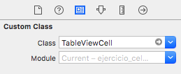

Una vez hemos vinculado la vista de la celda a nuestro controlador, vamos a modificar la altura de la celda desde el _size inspector_, usando una altura de 70 puntos:


Además de indicar la altura de la celda para el _Table View Cell_ \(lo cual nos sirve para saber cómo quedan los elementos en la vista de diseño\), también debemos hacerlo para las celdas del _Table View_:


Si quisieramos hacer esto mismo desde código \(no hace falta\), podríamos indicarlo así en el método _viewDidLoad_:

```swift
 self.tableView.rowHeight=70
```

Ahora queda arrastrar los objetos que queramos que aparezcan en la celda: en este ejemplo, vamos a añadir dos labels y una imagen \(_UIImageView_\). La celda quedará de la siguiente manera en el _Interface builder_:


En la pestaña de _Attributes Inspector_ de la celda escribimos un identificador para ella: `TableViewCell`. Esto servirá más adelante para referenciarla desde el controlador de la tabla y así poder utilizar las celdas desde este controlador:

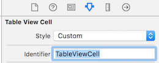

Ya hemos diseñado la vista de la celda. Ahora vamos a programar el código de su controlador.

#### Programando la celda

Tendremos que vincular a nuestra clase celda los _Outlets_ que hemos creado antes en la vista. Para ello abrimos el fichero _TableViewCell.swift_ y añadimos las siguientes propiedades a la clase:

```swift
@IBOutlet weak var imagen: UIImageView!
@IBOutlet weak var labelTitle: UILabel!
@IBOutlet weak var labelAuthor: UILabel!
```

> Alternativamente, se pueden crear los IBOutlets con el asistente \(es más cómodo\). Pinchando sobre el símbolo de los anillos \(arriba a la derecha\), se abre una segunda ventana. Se puede seleccionar la vista en una de las ventanas, y el código en otra. Después, puedes pinchar \(botón derecho\) sobre el componente de la vista y arrastrarlo al código de la declaración de la clase. Esto crea automáticamente las propiedades, y hace los enlaces. El mismo procedimiento es válido también para crear un _IBAction_.

Ahora volvemos a la vista de la celda en el storyboard y enlazamos los Outlets creados en la clase con los objetos de la vista.

Una vez hecho esto abrimos de nuevo la clase controladora de la tabla `TableViewController.swift` y modificamos los siguientes métodos:

```swift
 override func numberOfSections(in tableView: UITableView) -> Int {
     return 1
 }

 override func tableView(_ tableView: UITableView, numberOfRowsInSection section: Int) -> Int {
     return 3
 }

 override func tableView(_ tableView: UITableView, cellForRowAt indexPath: IndexPath) -> UITableViewCell {
     let cell = tableView.dequeueReusableCell(withIdentifier: "TableViewCell", for: indexPath) as! TableViewCell

     cell.labelTitle?.text = "Título \(indexPath.row+1)"
     cell.labelAuthor?.text = "Autor"
     cell.imagen?.image = UIImage(named : "logo-master.png")

     return cell
 }
```

Descarga la imagen _logo\_master.png_ desde [aqui](https://github.com/mastermoviles/interfaz-de-usuario-en-dispositivos-moviles-ios-a/tree/b1925b63c84bda8abfc2ae116a76afb1d085e88d/sesion1_guias_de_estilo_y_personalizaciones_avanzadas/logo-master.png) y arrástrala dentro de XCode a _Assets.xcassets_ del proyecto. Ahora ya podemos ejecutar la aplicación y nos debe aparecer la tabla con las celdas que acabamos de programar. Si la ejecutamos en el mismo dispositivo que teníamos seleccionado en la barra inferior \(sobre el cuál hemos hecho el diseño, por defecto iPhone 8\), nos saldrán los elementos más o menos bien colocados. En cambio, si la ejecutamos con el simulador para otro dispositivo distinto, probablemente se nos descoloquen los elementos de la celda porque falta ajustar los _constraints_. De momento no te preocupes por esto, lo arreglaremos más adelante.

La aplicación funciona y se muestra una tabla, aunque no tiene barra de navegación. Normalmente todos los controladores en iOS suelen ir incrustados en controladores contenedores, que son los que gestionan la navegación, como `UINavigationController`, `UITabBarController` o `UISplitViewController`. Para nuestro ejercicio, lo más adecuado incrustrar la tabla en un _Navigation Controller_, seleccionando el controlador de la tabla en el storyboard y eligiendo _Editor &gt; Embed in &gt; Navigation Controller_. Añade un título para la tabla mediante la siguiente línea de código en `viewDidLoad` \(o si lo prefieres, desde el _Interface Builder_\):

```swift
    self.title = "Mi tabla personalizada"
```

Una vez que tenemos las celdas hechas vamos a personalizar la tabla un poco más añadiendo un fondo a las celdas pares y otro a las impares, para hacer un efecto _zebra_. Necesitaremos dos imágenes más que se pueden descargar [aquí](https://github.com/mastermoviles/interfaz-de-usuario-en-dispositivos-moviles-ios-a/tree/b1925b63c84bda8abfc2ae116a76afb1d085e88d/sesion1_guias_de_estilo_y_personalizaciones_avanzadas/img_fondo_celdas.zip).

Abrimos la vista de la celda en el storyboard y arrastramos un `UIImageView` ocupando todo el espacio de la celda. Es necesario enviar esta vista al fondo, con el menú _Editor &gt; Arrange &gt; Send to back_. Si en el modo visual se van descolocando las vistas de la celda cuando las mueves \(no debería ocurrir en las últimas versiones de XCode\), ajusta los tamaños desde el _Size Inspector_.

En el fichero `TableViewCell.swift` enlazamos el nuevo `UIImageView`, como hemos hecho con el resto de elementos, y lo llamamos `fondo`.

Ahora, en la clase `TableViewController`, dentro del método `cellForRowAt` añadimos lo siguiente justo antes de `return cell`

```swift
if indexPath.row % 2 != 0 {
    cell.fondo.image = UIImage(named:"fondo_celda1.png")
}
else {
    cell.fondo.image = UIImage(named:"fondo_celda2.png")
}
```

Si ejecutamos ahora el proyecto tendremos nuestra tabla con las celdas personalizadas:

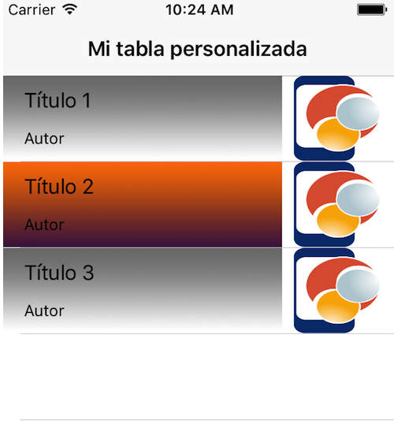

Sólo hay un problema: como hemos comentado anteriormente, se ha diseñado la vista para un iPhone en concreto \(iPhone 8 por defecto\), y si ejecutamos el simulador con otro iPhone \(por ejemplo el 5s\) los elementos de la celda nos saldrán descolocados. Para que salgan bien nos falta ajustar las _constraints_ de la vista.

Para esto, seleccionamos el `TableViewCell` desde el Storyboard y en la parte inferior \("All Views in Table View Cell"\) marcamos "Reset to Suggested Constraints". Probamos y vemos que la tabla es correcta, incluso rotando el dispositivo.

> Esta opción de Reset te puede sacar de más de un apuro cuando el ajustar el autolayout sea complicado. Recomiendo probar primero con ella, y si no funciona a la primera entonces ajustar las constraints a mano.

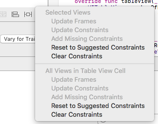

Para finalizar, extenderemos nuestro programa con las siguientes opciones:

_a\)_ Vamos a rellenar las celdas de la tabla con datos de libros. Para ello, crearemos una nueva clase \(_File &gt; New &gt; Swift file_\) a la que llamaremos `Book`. Reemplaza en este fichero `import Foundation` por `import UIKit`, y añade a la clase un `String` que será el título del libro, otro `String` que será el autor y una imagen \(`UIImage`\) que será la portada. Añade también un método `init` para inicializar las variables de la clase.

_b\)_ Ahora crearemos un array dentro de la clase `TableViewController`, lo inicializamos y lo completamos con los 3 libros que prefieras. Cada elemento del array será de la clase `Book`.

_c\)_ Una vez creado el array de libros vamos a mostrarlos en nuestra tabla. Para ello deberemos modificar los métodos de la clase `TableViewController`, asignando los datos del array a las celdas correspondientes.

_d\)_ Cuando hayamos terminado, comprobamos que la aplicación funciona según lo esperado.

### Ejercicio 2- Personalización de ToolBars

Los _ToolBar_, al igual que la gran mayoría de componentes, se pueden personalizar para conseguir las funcionalidades que deseemos en nuestras aplicaciones de iOS. En el siguiente ejemplo vamos a crear una vista _ToolBar_ con un estilo determinado usando una imagen de fondo, estilos para los botones, añadiendo botones de distinto tipo, etc.

Comenzamos creando un nuevo proyecto de tipo _Single-View application_ con el nombre `ejercicio_toolbar`. Abrimos la vista principal del storyboard. Arrastramosa la vista un objeto `UIToolBar` y lo situamos en la parte superior. También ponemos un objeto `UILabel` en el centro de la vista.


Ahora vamos a añadir los elementos que deseemos sobre el _ToolBar_. En nuestro caso arrastraremos desde el listado de objetos \(en el siguiente orden\) un _Text Field_, un _Flexible Space Bar_ y un _Segmented Control_. Borraremos el botón _Item_ de la izquierda. El _ToolBar_ debe quedar de la siguiente manera:


Como podemos observar, la función del objeto _Flexible Space_ no es más que añadir un espacio flexible entre dos objetos dentro de un _ToolBar_. Una vez que tenemos la barra con todos sus elementos vamos a definir los elementos dentro de la clase. Dentro del código de la clase `ViewController` añadimos los siguientes outlets:

```swift
@IBOutlet weak var toolBar: UIToolbar!
@IBOutlet weak var textField: UITextField!
@IBOutlet weak var segmentedControl: UISegmentedControl!

// Para la etiqueta centrada en la vista
@IBOutlet weak var segmentLabel: UILabel!
```

Seguidamente tenemos que enlazar los _outlets_ dentro de la vista. Si ejecutamos el código, veremos que el _toolbar_ y el _label_ salen descolocados \(si es que salen\). Vamos a añadir _constraints_ desde XCode para fijar los márgenes. Selecciona el toolbar, y añade las siguientes _constraints_ \(arriba, izquierda, derecha\) y marca _Constrain to margins_ para que no se solape con la barra de estado\):

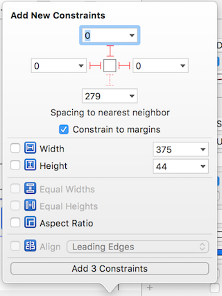

Vamos a centrar ahora el _label_, añadiendo restricciones de centrado horizontal y vertical:

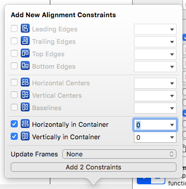

Puedes ver los _constraints_ añadidos para cada elemento en el _Size inspector_. Por ejemplo, para el _label_ tendríamos:

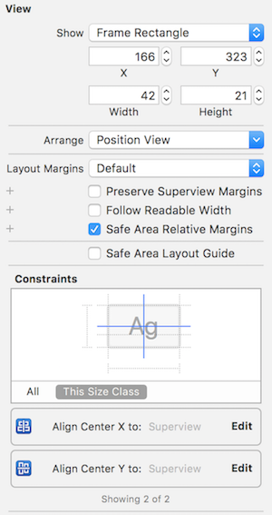

Ahora vamos a implementar la acción del _Segmented Control_, para ello declaramos el siguiente método dentro de la clase `ViewController`:

```swift
@IBAction func segmentedControlIndexChanged(_ sender: Any) {
          self.segmentLabel.text = self.segmentedControl.selectedSegmentIndex == 0 ? "Segmento 1" : "Segmento 2"
}
```

Para que el método se llame cuando se pulsa un botón del _Segmented Control_ debemos enlazarlo dentro de la vista. En este punto ya podemos ejecutar el proyecto por primera vez y comprobar que al pulsar sobre uno de los botones del _Segmented Control_ la etiqueta _Label_ cambia.

Ya tenemos un objeto _ToolBar_ con una personalización básica funcionando. Ahora vamos a personalizarlo un poco más: vamos a añadirle una imagen de fondo, a asignar un color de fondo al _Segmented Control_ y a modificar el diseño del _TextField_. Para hacer todo esto debemos cambiar el método `viewDidLoad` de la clase `ViewController` de forma que quede de la siguiente manera:

```swift
override func viewDidLoad() {
    super.viewDidLoad()

    // Vamos a añadir la imagen de fondo como un imageView, pero esta vez sin usar el storyboard (por hacerlo distinto)
    let iv = UIImageView(image:UIImage(named:"fondo_madera.png"))
    iv.frame = CGRect(x:0, y:0, width:self.toolBar.frame.size.width, height:44)
    iv.autoresizingMask = UIViewAutoresizing.flexibleWidth

    // Añadimos la subview
    self.toolBar.insertSubview(iv, at:0)

    // Cambiamos el color del SegmentedControl
    self.segmentedControl.tintColor=UIColor.brown

    // Personalizamos el TextField desde código (también se podría hacer desde el Interface Builder)
    self.textField.textColor = UIColor.white
    self.textField.borderStyle = UITextBorderStyle.none
    self.textField.background = UIImage(named:"fondo_textfield.png")
    self.textField.placeholder = "Escribe aquí"
}
```

Para que el código funcione debemos descargarnos las imágenes desde [aquí](https://github.com/mastermoviles/interfaz-de-usuario-en-dispositivos-moviles-ios-a/tree/b1925b63c84bda8abfc2ae116a76afb1d085e88d/sesion1_guias_de_estilo_y_personalizaciones_avanzadas/imagenes_toolbar.zip) y añadirlas a los _Assets_ del proyecto. Una vez hecho esto ya podemos ejecutar el proyecto y ver cómo ha cambiado. De esta forma tendremos nuestro componente _ToolBar_ bastante personalizado, dándole a la aplicación un aspecto visual diferenciado.


La metodología que acabamos de seguir nos serviría también para personalizar los componentes `UITabBar` y `UINavigationBar`.

