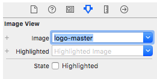
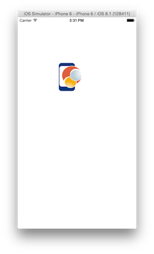
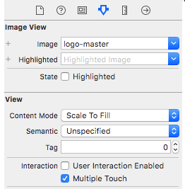

## Pantalla táctil

El sensor de pantalla es, obviamente, el más usado y común de todos. En una aplicación iOS que utilice los componentes básicos de `UIKit` como tablas, botones, campos de texto, etc. problamente no tendremos que preocuparnos por gestionar los eventos producidos por el sensor de la pantalla. En aplicaciones como juegos, o más elaboradas, es muy habitual que tengamos que hacer uso de los eventos que detallaremos a continuación.

La gestión de eventos de entrada (_Touch Events_) se realiza a través de los siguientes métodos, que más adelante detallaremos mediante un ejemplo:

* `func touchesBegan(Set<UITouch>, with: UIEvent?)`: Captura las pulsaciones sobre la pantalla. El método recibe la lista de pulsaciones que se detectan.
* `func touchesMoved(Set<UITouch>, with: UIEvent?)`: Captura los movimientos de las pulsaciones sobre la pantalla
* `func touchesEnded(Set<UITouch>, with: UIEvent?)`: Captura las últimas pulsaciones sobre la pantalla
* `func touchesCancelled(Set<UITouch>, with: UIEvent?)`: Evento que se ejecuta cuando cerramos la aplicación o la vista mientras se está detectando pulsaciones en la pantalla, o cuando se interrumpe por un evento externo como una llamada.

En general, estos eventos pertenecen a la clase `UIResponder`. Puedes obtener más información sobre esta clase <a href="https://developer.apple.com/reference/uikit/uiresponder">aquí</a>. Además de los eventos de pulsación sobre la pantalla, controla los de movimiento (por ejemplo cuando se agita el dispositivo) y los de control remoto (cuando se dispone de un dispositivo externo de control).

Los dispositivos iOS también admiten varias pulsaciones al mismo tiempo, lo que se le conoce con el nombre de _multitouch_. Esta característica hay que tenerla en cuenta a la hora de implementar los métodos anteriores. Para entrar más en profundidad en el uso de las funciones de pulsaciones en iOS, vamos a realizar una aplicación de ejemplo en la que arrastraremos una imagen por la pantalla de nuestro dispositivo.

## Ejercicio 1 - Gestos

Comenzamos creando un proyecto en XCode de tipo _Single View_ que guardaremos con el nombre `ejercicio_touch`. Creamos un objeto de tipo _UIImageView_, lo arrastramos a la vista colocándolo en la parte superior izquierda de la pantalla, y lo enlazamos a nuestro `ViewController` para crear la propiedad, a la que llamaremos _imageView_. Arrastra la imagen <a href=".gitbook/assets/logo-master.png">logo-master.png</a> al proyecto y asígnala a la vista como se indica a continuación (aunque también se podría hacer por código):



Ahora editamos el archivo `ViewController.swift`, y añadimos un _booleano_ llamado `tocaImagen`. Debe quedar de la siguiente forma:

```swift
@IBOutlet weak var imageView: UIImageView!
var tocaImagen = false
```

Como se puede ver tenemos dos propiedades: una imagen que podremos mover por la pantalla, y un _booleano_ que utilizaremos para indicar si la estamos moviendo o no. Ahora añadimos al fichero `ViewController.swift` los tres métodos que gestionan los gestos:

```swift
override func touchesBegan(_ touches: Set<UITouch>, with event: UIEvent?) {
    if let touch = touches.first {
        print("Touches began")
        let loc = touch.location(in: self.view)
        if self.imageView.frame.contains(loc) {
            print("Detectado toque sobre la imagen")
            self.tocaImagen = true
        }
    }
    super.touchesBegan(touches, with: event)
}

override func touchesMoved(_ touches: Set<UITouch>, with event: UIEvent?) {
    if let touch = touches.first {
        print("Touches moved")
        let loc = touch.location(in: self.view)
        if self.tocaImagen == true {
            self.imageView.center = loc
        }
    }
    super.touchesMoved(touches, with: event)
}

override func touchesEnded(_ touches: Set<UITouch>, with event: UIEvent?) {
        print("Touches ended")
        self.tocaImagen = false
        super.touchesEnded(touches, with: event)
}

override func touchesCancelled(_ touches: Set<UITouch>, with event: UIEvent?) {
        print("Touches cancelled")
        self.tocaImagen = false
        super.touchesCancelled(touches, with: event)
}
```

Como podemos observar en el código anterior, hemos utilizado la clase de Cocoa `UITouch`. Esta clase representa el evento de toque. Al mismo tiempo que el usuario interactúa con la pantalla, iOS envía continuamente mensajes al evento correspondiente (uno de los cuatro comentados anteriormente). Cada evento incluye información sobre los distintos toques en la secuencia producida por el usuario y cada toque en particular corresponde a una instancia de la clase `UITouch`.

Con esto último ya podemos ejecutar la aplicación y veremos que podemos pulsar sobre la imagen y arrastrarla.



El funcionamiento de estos métodos es muy simple. Primero se ejecuta `touchesBegan` que detecta el primer _toque_ sobre la pantalla, en el comprobamos si la posición del toque está dentro del cuadro (_frame_) del `UIImageView`. Si es así actualizamos la variable booleana a `true`, y en caso contrario no hacemos nada. En el momento en que arrastremos el dedo sobre la pantalla se ejecutará continuamente el método `touchesMoved`. En este, si la variable booleana `tocaImagen` está a `true` actualizamos la posición de la imagen a la posición detectada, y en caso contrario no hacemos nada. Por último, cuando dejamos de pulsar la pantalla se ejecutará el método `touchesEnded` el cual simplemente volverá a actualizar la variable booleana a `false`.

En caso de que queramos detectar varios toques al mismo tiempo, primero deberemos activarlo, por ejemplo en `viewDidLoad`:

```swift
   self.imageView.isMultipleTouchEnabled = true
```

También podríamos haberlo hecho desde el Storyboard, pinchando sobre el `UIImageView`:



Y luego podemos gestionar los toques simultáneos como en el siguiente ejemplo, en el que vamos a modificar el método `touchesBegan`:

```swift
override func touchesBegan(_ touches: Set<UITouch>, with event: UIEvent?) {
    if let touch = touches.first {  // Sólo nos centramos en el primer toque
        print("Touches began")

        let touchCount = event!.allTouches!.count // Número de dedos pulsando
        let tapCount = touch.tapCount  // Núero de pulsaciones rápidas

        print("Finger count= \(touchCount)")
        print("Tap count= \(tapCount)")

        let loc = touch.location(in: self.view)
        if self.imageView.frame.contains(loc) {
            print("Detectado toque sobre la imagen")
            self.tocaImagen = true
        }
    }
    super.touchesBegan(touches, with: event)
}
```

En el fragmento de código anterior, si se ha realizado alguna pulsación distinguimos primero el número de dedos y luego comprobamos el número de pulsaciones rápidas (equivalente a un doble click del ratón). Esto es un claro ejemplo de gestión de la función _multitouch_ de iOS y, como se puede ver, es bastante simple de implementar.

> Para simular dos pulsaciones al mismo tiempo en el simulador de iPhone/iPad de XCode, podemos pulsar la tecla `alt` (opción) mientras movemos el cursor.

Desde _XCode 7_ existe la opción de usar <a href="https://developer.apple.com/ios/3d-touch/">_3D touch_</a> para iPhone 6S/7 y iPad Pro, y desde _XCode 7.3_ podemos usar el simulador (antes estaba limitado a dispositivos reales). No vamos a entrar en detalles sobre el _3D Touch_, pero si quieres saber más la clase `UITouch` tiene una propiedad adicional llamada `force` que se usa para medir la fuerza de la pulsación del usuario con respecto a una fuerza máxima cuyo valor es `maximumPossibleForce`.

```swift
if self.traitCollection.forceTouchCapability == UIForceTouchCapability.available {
    print("Force= \(touch.force) from \(touch.maximumPossibleForce)")
}
```

Con un iPad Pro también se puede usar un lápiz digital (_Apple Pencil_) en el dispositivo. Podemos distinguir un trazo del lápiz de una pulsación del dedo mediante la siguiente condición:

```swift
if touch.type == .stylus {
   print("Stylus detected")
}
```

Además, en el iPhone 7 Apple ha introducido _Haptic Feedback_, que permite responder físicamente a las interacciones del usuario con la pantalla. Para más información, se puede consultar la <a href="https://developer.apple.com/reference/uikit/uifeedbackgenerator"> referencia</a> de la clase `UIFeedbackGenerator`.

## UIGestureRecognizer: Reconocimiento de gestos multitáctiles

En el punto anterior hemos visto como mover un objeto por la pantalla usando los métodos de detección de pulsaciones en la pantalla y programando todo el código nosotros.

Esto está bien para gestos simples, pero el problema de lo que hemos implementado anteriormente es que si queremos detectar un gesto como un _swipe_, tendremos que registrar las notificaciones para cada toque de las vistas (usando `touchesBegan`, `touchesMoved` y `touchesEnded`). En las primeras versiones de iOS cada programador escribía código distinto para detectar los toques en la pantalla, provocando bugs e incosistencias entre apps.

Para evitar esto, hace mucho tiempo (iOS 3) Apple añadió la clase `UIGestureRecognizer` para los gestos comunes en iOS. Esta clase nos permite gestionar los toques, efecto "pellizco" (por ejemplo para hacer zoom), rotaciones, swipes, pans, y pulsaciones largas, entre otras. Usando esta clase no sólo ahorramos mucho código sino que también hacemos que nuestras apps sean consistentes. Los gestos que podemos gestionar en iOS son los siguientes:

* Toque (_tap_): Consiste en presionar o hacer "click" sobre un botón o cualquier objeto que esté en pantalla.
* Arrastre (_drag_): Mover el dedo sobre la pantalla en una dirección, puede usarse para navegar sobre los elementos de una tabla, por ejemplo.
* Arrastre rápido (_flick_): Como el anterior, pero más rápido. Sirve para moverse por la pantalla de forma rápida.
* Arrastre lateral (_swipe_): Mover el dedo en dirección horizontal, sirve para mostrar el botón de "Eliminar" en una fila de una tabla.
* Doble toque (_double tap_): Presionar dos veces seguidas y de forma rápida la pantalla. Sirve para aumentar una imagen o un mapa, por ejemplo.
* Pellizco exterior (_pinch open_): Gesto de pellizco sobre la pantalla que sirve para aumentar una imagen o un mapa.
* Pellizco interior (_pinch close_): El inverso del anterior.
* Toque continuo (_touch and hold_): Como el toque básico, pero manteniendo el dedo sobre la pantalla. Sirve para mostrar un menu contextual sobre la
zona que se pulsa.
* Agitar (_shake_): Para inicializar una acción de deshacer (undo) o rehacer (redo).
* 3D touch (_hard press_): Los modelos posteriores a iPhone 6S añaden un gesto 3D que se activa cuando pulsamos la pantallas con una presión mayor. Se usa para mostrar información como un _peek_ (una vista flotante) o _pop_ (menú contextual).

Puedes ver vídeos de ejemplo para cada movimiento en la guía de estilo, sección <a href= "https://developer.apple.com/ios/human-interface-guidelines/interaction/gestures/">Interaction > Gestures</a>. También se puede consultar más información sobre _3D touch_ <a href="https://developer.apple.com/ios/3d-touch/">aquí</a>.

Usar `UIGestureRecognizer` es muy sencillo, simplemente hay que:
* Crear un _Gesture Recognizer_. Cuando se crea un elemento de esta clase debemos especificar una función _callback_. Esta función se llamará cuando los gestos empiecen, cambien o terminen.
* Añadir un _Gesture Recognizer_ a la vista. Cada _gesture recognizer_ se asocia con una (y **sólo una**) vista. Cuando se produce un gesto dentro de los límites de esa vista, el _recognizer_ mirará si coincide con el tipo de gesto buscado, y si es así se notificará mediante la función _callback_.

Podemos añadir un _Gesture Recognizer_, bien mediante código o usando el storyboard. Vamos a ver primero cómo hacerlo mediante código (y luego lo veremos con storyboard), haciendo un ejercicio sencillo similar al anterior.

## Ejercicio 2 - Multitouch

Crea un nuevo proyecto y llámalo `ejercicio_multitouch`. Como en el anterior, añade una _UIImageView_ en la parte superior izquierda de la vista y asígnale la imagen _logo-master_. Recuerda marcar para el `UIImageView` desde el Storyboard las casillas `User Interaction Enabled` y `Multiple Touch`, o alternativamente hacerlo mediante código en _viewDidLoad_:

```swift
self.imageView.isUserInteractionEnabled = true
self.imageView.isMultipleTouchEnabled = true
```

Vamos a definir un gesto que realice la función de pulsación, similar a lo realizado en el primer ejemplo, pero con `UIGestureRecognizer`. Para ello, en `ViewController.swift`  asignamos el protocolo:

```swift
class ViewController : UIViewController, UIGestureRecognizerDelegate
```

Y en el fichero `ViewController.swift` añadimos lo siguiente al final del método `viewDidLoad`:

```swift
let tap = UITapGestureRecognizer(target: self, action:#selector(handleTap))
tap.delegate = self
self.imageView.addGestureRecognizer(tap)
```

En el código anterior nos hemos definido un objeto de la clase `UITapGestureRecognizer`, al cual le hemos asignado una acción llamada `handleTap` que se ejecutará cuando se detecte una pulsación. También hemos asignado el objeto creado a la imagen para que los gestos estén únicamente asociados a esa vista.

Ahora implementamos el método `handleTap`:

```swift
@objc func handleTap(sender: UITapGestureRecognizer) {
    print("Tap");
}
```

Si volvemos a compilar la aplicación veremos ya nos sale el mensaje cuando pulsamos sobre la imagen.

A continuación vamos a añadir los gestos de arrastre, rotación y el de "pellizcar", de la misma manera que hemos implementado el de pulsación:

```swift
  // Gesto de pulsar y arrastrar
  let pan = UIPanGestureRecognizer(target: self, action:#selector(handlePan))
  pan.delegate = self
  self.imageView.addGestureRecognizer(pan)

  // Gesto de rotación
  let rotation = UIRotationGestureRecognizer(target: self, action:#selector(handleRotation))
  rotation.delegate = self
  self.imageView.addGestureRecognizer(rotation)

  // Gesto de pellizcar
  let pinch = UIPinchGestureRecognizer(target: self, action:#selector(handlePinch))
  pinch.delegate = self
  self.imageView.addGestureRecognizer(pinch)
```

Implementamos los métodos de las acciones:

```swift
@objc func handlePan(sender: UIPanGestureRecognizer) {
    print("Pan")
    let translation = sender.translation(in: self.view)
    if let view = sender.view {
        view.center = CGPoint(x: view.center.x + translation.x, y: view.center.y + translation.y)
    }
    sender.setTranslation(CGPoint.zero, in: self.view)
}

@objc func handleRotation(sender: UIRotationGestureRecognizer) {
    print("Rotation")
    if let view = sender.view {
        view.transform = view.transform.rotated(by: sender.rotation)
        sender.rotation = 0
    }
}

@objc func handlePinch(sender: UIPinchGestureRecognizer) {
    print("Pinch")
    if let view = sender.view {
        view.transform = view.transform.scaledBy(x: sender.scale, y: sender.scale)
        sender.scale = 1;
    }
}
```

Si ejecutamos la aplicación veremos que funciona todo correctamente pero al intentar realizar dos gestos al mismo tiempo estos no funcionan de manera simultánea por ejemplo, ampliar y rotar). Para que dos o más gestos se puedan usar al mismo tiempo, en el fichero `ViewController.swift` tenemos que implementar el método `shouldRecognizeSimultaneouslyWithGestureRecognizer`:

```swift
func gestureRecognizer(_ gestureRecognizer: UIGestureRecognizer, shouldRecognizeSimultaneouslyWith otherGestureRecognizer: UIGestureRecognizer) -> Bool {
    return true
}
```

Si volvemos a ejecutar la aplicación de nuevo, veremos que ya podemos realizar dos o más gestos al mismo tiempo.

En total podemos usar los siguientes gestos en nuestras aplicaciones, además de crear los nuestros propios creando subclases de `UIGestureRecognizer`:

* `UITapGestureRecognizer`
* `UIPinchGestureRecognizer`
* `UIRotationGestureRecognizer`
* `UISwipeGestureRecognizer`
* `UIPanGestureRecognizer`
* `UIScreenEdgePanGestureRecognizer`
* `UILongPressGestureRecognizer`

Y esto es lo básico para poder implementar reconocimiento de gestos en nuestra aplicación.

Para finalizar vamos a implementar un gesto adicional, pero en lugar de hacerlo con código esta vez lo haremos desde el Storyboard, para ver una forma alternativa. Para hacerlo de esta forma (aunque probablemente es más rápido desde código), selecciona el gesto _Long press Gesture Recognizer_ desde la _Biblioteca de objetos_, y arrástralo sobre la imagen.

Puedes cambiar desde el _Interface builder_ sus parámetros, como por ejemplo la duración mínima. Finalmente asigna un método al gesto, arrastrando el objeto al código de la clase y seleccionando _Action_, y conecta el delegado con nuestro `ViewController`. El método debe imprimir el mensaje `print("long press")` cuando se realice una pulsación larga sobre la imagen. Con el botón derecho sobre el gesto puedes ver con qué objeto se relaciona y cambiarlo si es necesario.
